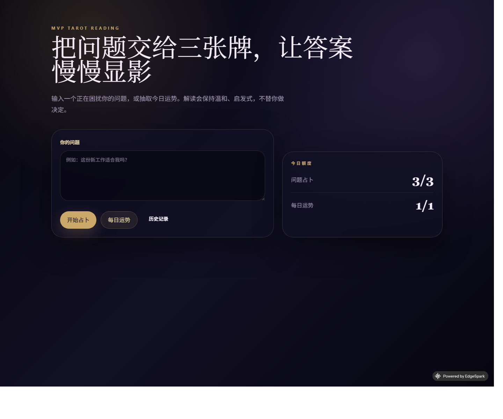
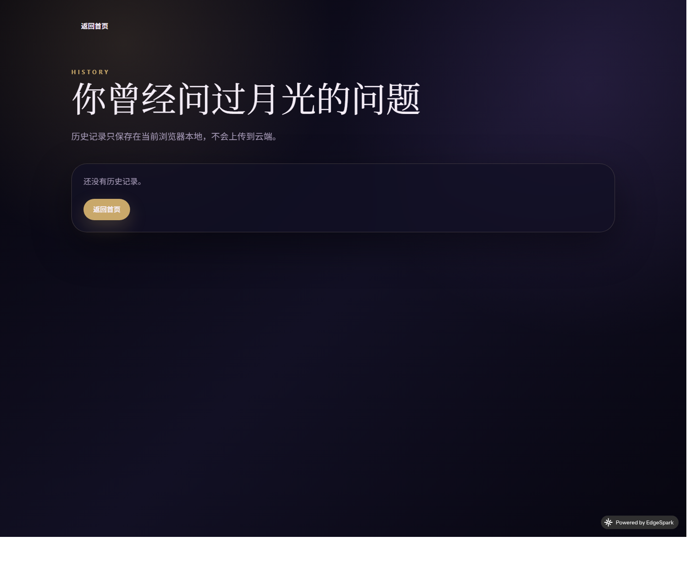

# Luna Arcana Tarot

A dark, mystical tarot web app built on EdgeSpark. Users can ask a question or draw a daily fortune, reveal a past-present-future spread, get a one-time AI-style interpretation, review local history, and export a share image.

Live app: https://ready-scorpion-7924.edgespark.app

## Highlights

- Three-card spread with `past / present / future`
- Two entry modes: question reading and daily fortune
- Interpretation logic that adapts to question themes like love, work, study, money, relationships, and choices
- Local history stored in the browser
- Daily limits: `3` question readings and `1` daily fortune
- Share image generation for saving or posting results
- EdgeSpark deployment-ready structure with `server/` and `web/`

## Screenshots





## Tech Stack

- EdgeSpark
- React 19
- TypeScript
- Vite
- Tailwind CSS v4
- Hono

## Project Structure

```text
.
├─ server/                 EdgeSpark server entry and generated types
├─ web/                    Tarot frontend SPA
├─ configs/                EdgeSpark auth config
├─ edgespark.toml          EdgeSpark project config
└─ .github/workflows/      CI and deploy automation
```

## Local Development

Prerequisites:

- Node.js 24+
- EdgeSpark CLI

Install dependencies:

```bash
cd server && npm install
cd ../web && npm install
```

Run checks:

```bash
cd server && npm run typecheck
cd ../web && npm run build
```

## Deploy

This repository is already connected to an EdgeSpark project through [edgespark.toml](edgespark.toml).

Manual deploy:

```bash
edgespark deploy --dry-run
edgespark deploy
```

## GitHub Actions

This repo includes two workflows:

- `CI`: installs dependencies, runs server type checks, and builds the web app on every push and pull request
- `Deploy to EdgeSpark`: deploys on `main` pushes and manual dispatch

To enable automated deploys in GitHub Actions, add this repository secret:

- `EDGESPARK_API_KEY`: an EdgeSpark API token or CLI access token with deploy access

The workflow reads `project_id` from [edgespark.toml](edgespark.toml), so no extra project ID secret is required.
